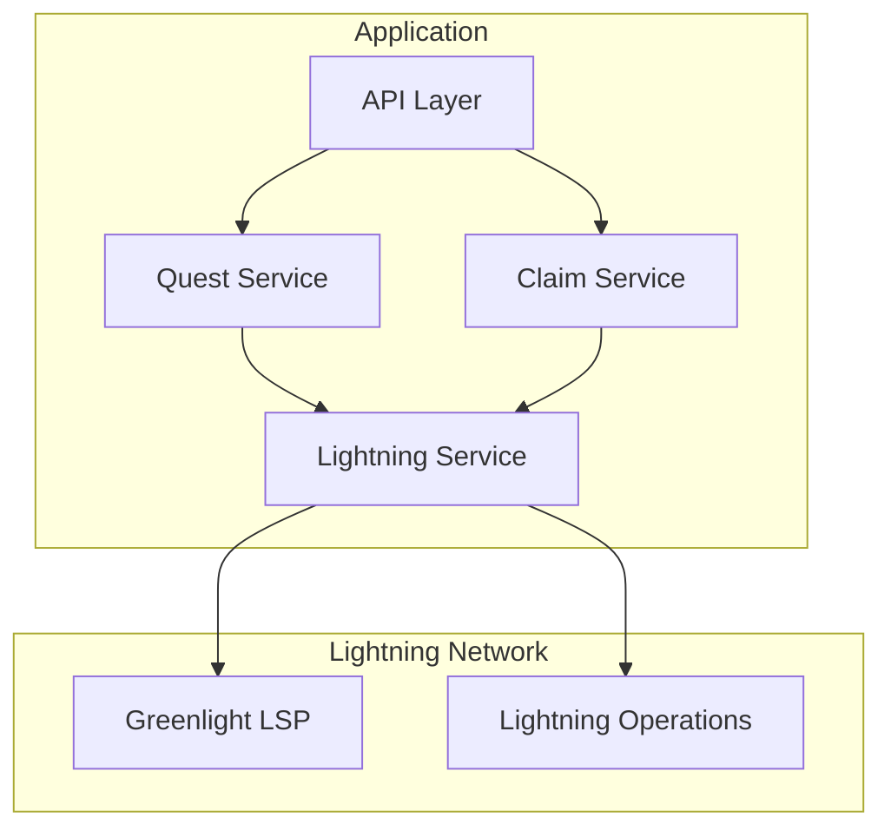
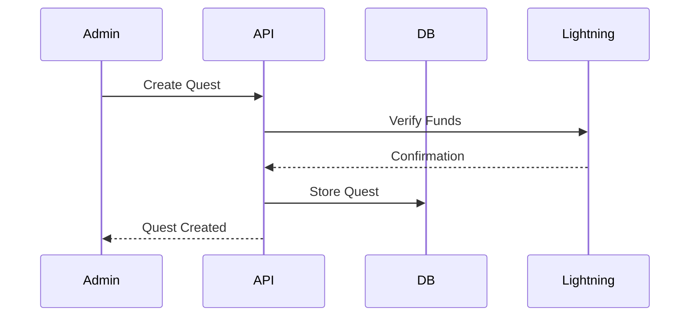
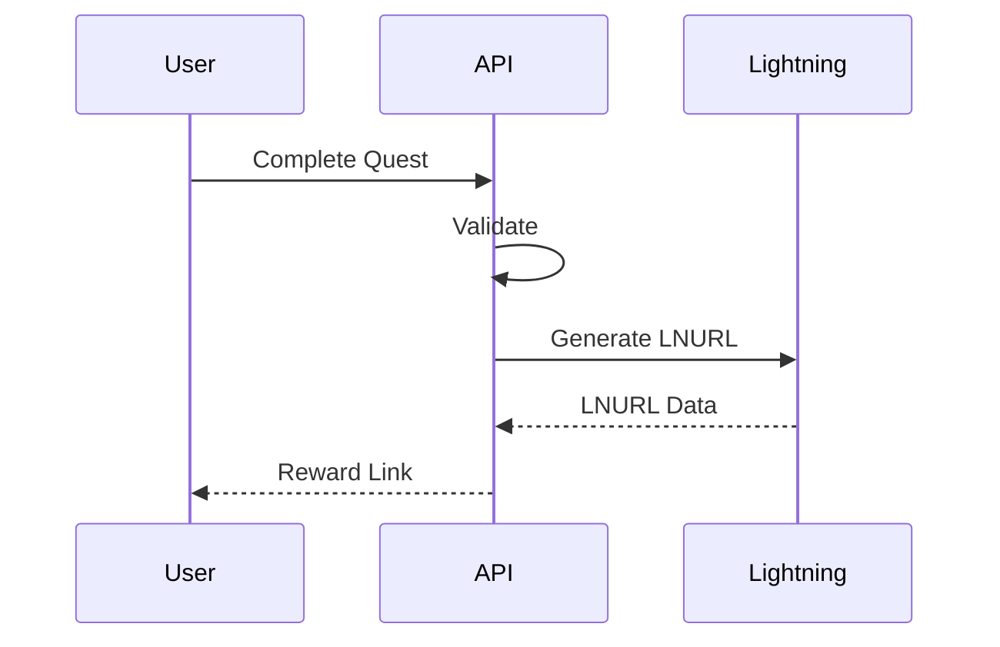

# ⚡ Bitcoin Lightning Quest System - Technical Assignment

[](LICENSE) [](https://lightning.network) [](https://nodejs.org) [](https://www.typescriptlang.org)

<div align="center">
  
</div>

## 📑 Table of Contents
- [Executive Summary](#-executive-summary)
- [Technical Requirements](#-technical-requirements)
- [System Architecture](#-system-architecture)
- [Core Features](#-core-features)
- [System Flows](#-system-flows)
- [Data Models](#-data-models)
- [API Specification](#-api-specification)
- [Security Requirements](#-security-requirements)
- [Bonus Features](#-bonus-features)
- [Evaluation Criteria](#-evaluation-criteria)
- [Resources](#-resources)

## 📋 Executive Summary
Develop a Lightning Network-powered quest system that enables automated reward distribution through LNURL-withdraw. The system should allow administrators to create quests with specific completion criteria and automatically distribute Lightning Network rewards to users who complete them.

## 🔧 Technical Requirements

### Required Stack
- Node.js (≥18.0.0)
- TypeScript
- MongoDB
- Lightning Node (via Greenlight LSP)
- Express.js or NestJS

### Development Requirements
- LNURL-withdraw implementation
- RESTful API design
- Comprehensive error handling
- Automated tests
- API documentation

## 🏗 System Architecture

### Core Components


### Modules
1. Quest Management
2. Lightning Integration
3. Claim Processing
4. API Interface

## 🎯 Core Features

### Quest Management
- Quest creation and configuration
- Quest listing and status tracking
- Completion validation
- Reward management

### Lightning Integration
- Greenlight LSP node management
- LNURL-withdraw generation
- Payment verification
- Balance management

### Claim System
- Reward claim processing
- Status tracking
- Payment verification
- Analytics

## 🔄 System Flows

### Quest Creation


### Reward Claim


## 💾 Data Models

### Quest Schema
```typescript
interface Quest {
  id: string;
  title: string;
  description: string;
  rewardAmount: number;
  totalRewards: number;
  claimedRewards: number;
  active: boolean;
  startDate: Date;
  endDate: Date;
  conditions: Record<string, any>;
}
```

### Claim Schema
```typescript
interface Claim {
  id: string;
  questId: string;
  status: 'pending' | 'validated' | 'claimed' | 'paid';
  lnurlData?: Record<string, any>;
  createdAt: Date;
  claimedAt?: Date;
}
```

## 🔌 API Specification

### Quest Management
```
POST   /api/quests          - Create quest
GET    /api/quests          - List quests
GET    /api/quests/:id      - Get quest details
PUT    /api/quests/:id      - Update quest
DELETE /api/quests/:id      - Delete quest
```

### Claim & Reward
```
POST   /api/quests/validate - Validate completion
POST   /api/claim-reward    - Generate LNURL
GET    /api/claim/:id       - Check claim status
```

## 🔒 Security Requirements
- Secure key management
- Rate limiting
- Input validation
- Error handling
- Testnet usage only

## ⭐ Bonus Features
- NestJS implementation
- [BONUS] Webhook system

## 📊 Evaluation Criteria

### Technical Implementation (60%)
- Code quality and organization
- Lightning Network integration
- Error handling
- Security implementation

### Documentation (20%)
- API documentation
- Setup instructions
- Code comments

### Bonus Features (20%)
- Additional features implementation
- Innovation
- UI/UX considerations
- Performance optimizations

## 📚 Resources
- [Greenlight LSP Documentation](https://blockstream.com/lightning/greenlight/)
- [LNURL Specifications](https://github.com/lnurl/luds)
- [NestJS Documentation](https://docs.nestjs.com/)
- [Lightning Network Resources](https://lightning.network)