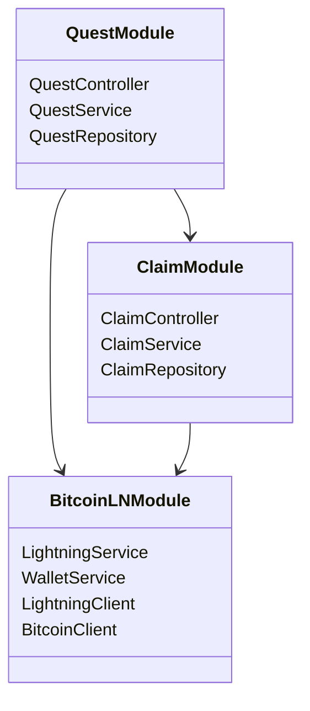

# ⚡ Bitcoin Lightning Quest System - Technical Assignment

## 🎯 Overview
Quest system implementation that leverages Bitcoin Lightning Network for automated rewards distribution. The system enables quest creation, validation, and automatic reward distribution through LNURL-withdraw.

## 🏗 System Architecture

### 🧩 Core Components
1. Quest Management System
2. Bitcoin & Lightning Network Integration
3. LNURL-withdraw Implementation
4. API Interface for External Integration

### 🛠 Technical Stack
- Node.js
- Bitcoin Core (testnet)
- LND/Core Lightning
- MongoDB
- Express.js/NestJS (bonus)
- bitcoinjs-lib for Bitcoin operations
- lnurl-pay for Lightning Network interactions
- Greenlight LSP for Lightning node management

## 🔄 System Flows

### Quest Creation Flow


### Quest Validation Flow


### Reward Claim Flow


## 📊 System Architecture Diagram


### 🧩 Core Modules

#### 1. Quest Module
- Handles quest creation and validation
- Maintains active quest states
- Verifies completion conditions

#### 2. Bitcoin/LN Module
- Manages Bitcoin and Lightning Network integration
- Handles LNURL-withdraw generation
- Monitors wallet balance and transactions

#### 3. Claim Module
- Manages reward claim requests
- Coordinates payment process with Bitcoin/LN module
- Tracks claim request states

## 🔌 API Endpoints

### Quest Management
```
POST /api/quests
- Creates new quest
- Body: quest details

GET /api/quests
- Lists all active quests

GET /api/quests/:id
- Gets single quest details

PUT /api/quests/:id
- Updates quest details
```

### Claim & Reward
```
POST /api/quests/:id/validate
- Validates quest completion
- Body: completion data

POST /api/claim-reward
- Generates LNURL-withdraw
- Returns QR code
- Updates reward counters

GET /api/rewards/status/:claimId
- Checks claim status
```

## 💾 Data Models

### Quest Schema
```javascript
{
  id: ObjectId,
  title: String,
  description: String,
  reward_amount: Number,
  total_rewards: Number,
  claimed_rewards: Number,
  active: Boolean,
  start_date: Date,
  end_date: Date,
  conditions: Object
}
```

### Claim Schema
```javascript
{
  id: ObjectId,
  quest_id: ObjectId,
  claim_data: Object,
  status: String, // pending, validated, claimed, paid
  lnurl_data: Object,
  created_at: Date,
  claimed_at: Date
}
```

## ✅ Implementation Requirements

### 🔑 Core Features
1. Quest management system
2. Lightning Network integration
3. LNURL-withdraw implementation
4. External API integration
5. [BONUS] Comprehensive test suite

### ⭐ Bonus Features
- [BONUS] NestJS implementation
- [BONUS] Webhook system

## 🔒 Security Requirements
- Testnet usage only
- Secure key management
- Comprehensive logging
- Error handling
- Wallet backup system

## 📚 Technical Implementation Details

### Bitcoin Integration
- Using `bitcoinjs-lib` for all Bitcoin-related operations
  - Transaction creation and signing
  - Address management
  - PSBT handling
  - Network configuration (testnet)

### Lightning Network Integration
- LNURL implementation using `lnurl-pay` library
  - LNURL-withdraw flow
  - QR code generation
  - Payment verification
- Greenlight LSP Integration
  - Remote node management
  - Secure key handling
  - Automated channel management
  - Backup and recovery procedures

## 📚 Resources
- [LND API Documentation](https://api.lightning.community/)
- [LNURL Specifications](https://github.com/lnurl/luds)
- [Bitcoin Core RPC](https://developer.bitcoin.org/reference/rpc/)
- [Core Lightning Documentation](https://lightning.readthedocs.io/)
- [NestJS Documentation](https://docs.nestjs.com/)
- [bitcoinjs-lib Documentation](https://github.com/bitcoinjs/bitcoinjs-lib)
- [lnurl-pay Documentation](https://github.com/lnurl/lnurl-pay)
- [Greenlight LSP Documentation](https://blockstream.com/greenlight/)